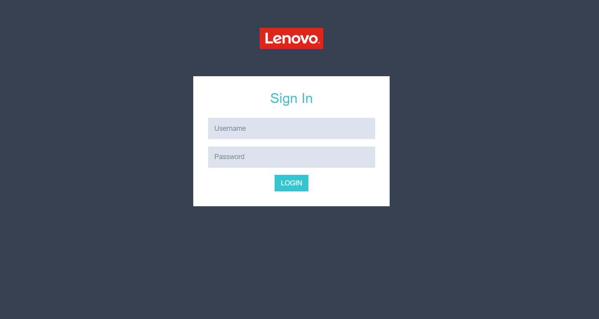
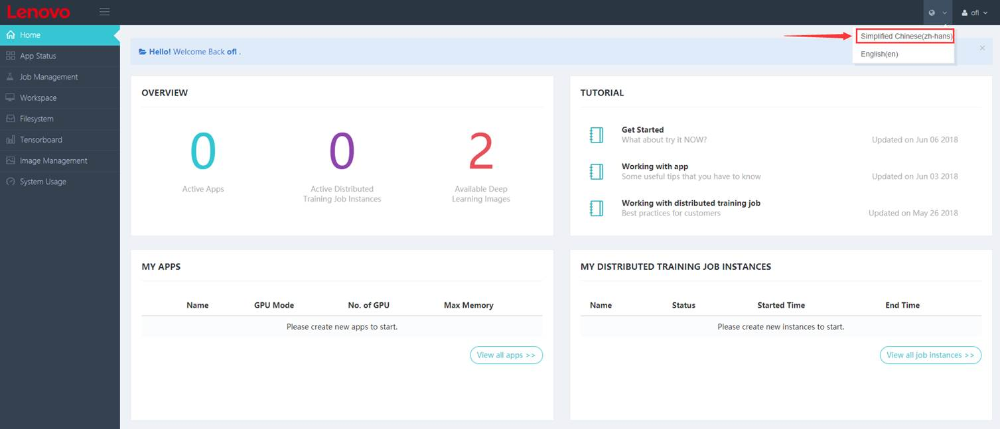

Get Started
======================================
---

<link rel="stylesheet" type="text/css" media="all" href="https://fonts.googleapis.com/earlyaccess/notosansscsliced.css" />

## 1. 系统功能
---
### 1.1 主要功能

- 供多租户使用的深度学习云平台，利用CUDA和GPU作计算；
- 提供基于Jupyter的Web和console界面，集成Python开发环境，简单易用；
- 封装支持Tensorflow，MxNet，Caffe等主流框架；
- 提供应用层的demo和案例；
- （基于服务器）线性扩展支持高负载；
- 基于容器技术作资源隔离，利用容器管理引擎进行编排调度；
- 支持多GPU调度，支持分布式计算；

### 1.2 系统架构

用户创建的每个应用对应一个后台容器，当收到容器创建的请求时，容器调度服务器会根据GPU服务器的使用情况选择相对负载较轻的GPU服务器创建容器，并将在NFS服务器中用户的文件夹挂载到创建的容器中。当容器成功创建后用户即可在容器进行开发。

### 1.3 运行环境

+ 服务器建议配置：
    - 具有`E5-2640v4`或以上CPU
    - 128G以上内存
    - 500G以上硬盘
    - Nvidia K40 GPU

+ NFS服务器配置：
    - 4TB以上存储。

+ 操作系统：
    - Ubuntu 16.04/CentOS 7/RHEL 7

---
## 2. 总览
---
### 2.1 登录界面

访问本平台后，用会看到下面的登录界面，如`图2.1`所示：

图2.1 DeepNEX平台登录界面

### 2.2 系统首页

- 用户登录本系统后，默认进入的第一个页面为系统首页，如`图2.2`所示。
- 系统首页分为两个部分，左侧菜单栏为本系统提供的八个功能列表：
    - 首页
    - App状态
    - 工作空间
    - 文件系统
    - 可视化
    - 镜像管理
    - 系统使用情况
- 系统首页的右侧区域包含四大块:
    - 概述
    - 教程
    - 应用
    - 作业实例

图2.2 系统首页

### 2.3 中英文切换

- 在系统首页，用户可以根据自己的喜好选择合适的语言，提供`中文`和`英文`两种语言。
- 点击右上角的地球图标（`图2.3.1`红色箭头所指），例如选择【Simplified Chinese(zh-hans)】，就能切换到中文界面，切换后如图2.3.2所示。

图2.3.2 中英文切换页

